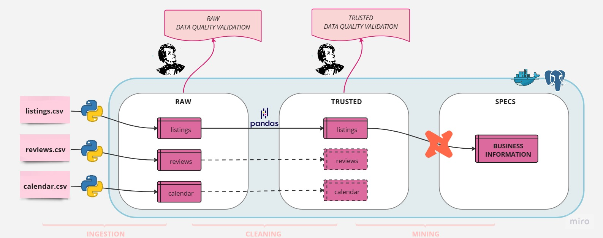

## Módulo: Analytics Engineering

## Projeto: Engenharia de Dados e Garantia de Qualidade no Conjunto de Dados do Airbnb no Rio de Janeiro.



#### Introdução à Base de Dados do Airbnb

O conjunto de dados "Inside Airbnb", disponível no website "http://insideairbnb.com/", é uma valiosa fonte de informações sobre listagens de hospedagem, avaliações de hóspedes e disponibilidade de calendário em várias cidades ao redor do mundo, incluindo o Rio de Janeiro. Antes de prosseguirmos com a engenharia de dados, é importante entender os principais componentes deste conjunto de dados:

1. **Listing (Listagem):** Este conjunto de dados contém informações detalhadas sobre as propriedades listadas no Airbnb. Cada registro representa uma listagem individual e inclui informações como o tipo de propriedade, preço, localização, número de quartos, comodidades oferecidas e muito mais.

2. **Reviews (Avaliações):** O conjunto de dados de avaliações contém informações sobre as avaliações feitas por hóspedes que ficaram nas propriedades listadas. Ele inclui dados como a data da avaliação, o identificador da propriedade, os comentários escritos pelos hóspedes, e outras informações.

3. **Calendar (Calendário):** Este conjunto de dados contém informações sobre a disponibilidade das propriedades ao longo do tempo. Ele lista as datas em que as propriedades estão disponíveis para reserva, bem como os preços para cada data.

O dicionário dos dados também está disponível no website: "http://insideairbnb.com/".

#### Passos do Projeto

1. **Aquisição de Dados e Armazenamento de Dados em PostgreSQL - Camada Bronze**
   - Baixe o conjunto de dados "Inside Airbnb" do Rio de Janeiro da fonte oficial (http://insideairbnb.com/) e promova uma estruturação simples nos dados.
   - Crie um banco de dados PostgreSQL para armazenar os dados brutos das 3 tabelas ("Listing", "Reviews" e Calendar") na camada "bronze".

<br>

2. **Data Clean - Camada Silver:**
   - Identifique e lide com valores ausentes, duplicatas e outliers nos dados brutos da camada "bronze".
   - Padronize e limpe os nomes das colunas, convertendo-os em um formato consistente.
   - Realize uma limpeza textual em campos, como descrições de propriedades, removendo caracteres especiais e erros de digitação.

<br>

3. **Data Quality - Camada Silver:**
   - Defina métricas de qualidade de dados, como integridade, precisão e consistência para os dados da camada "bronze".
   - Implemente verificações para garantir que os dados da camada "silver" estejam em conformidade com essas métricas.
   - Estabeleça um sistema de monitoramento contínuo da qualidade dos dados da camada "silver".

<br>

4. **Testes de Qualidade - Camada Silver:**
   - Utilize a biblioteca Great Expectations para criar testes de qualidade automatizados que verifiquem as expectativas definidas para os dados da camada "silver".
   - Desenvolva testes que assegurem que os dados da camada "silver" atendam às regras de negócios e aos requisitos de qualidade.

<br>

5. **Transformação de Dados com dbt - Camada Silver:**
   - Utilize a ferramenta dbt para criar a camada "silver" de dados, realizando transformações e preparando os dados da camada em questão.
   - Mantenha um controle de versão dos modelos dbt relacionados à camada "silver" e automatize a execução das transformações.

<br>

6. **Armazenamento de Dados em PostgreSQL - Camada Silver:**
   - Armazene os dados da camada "silver" no mesmo banco de dados PostgreSQL.
   - Estabeleça conexões entre o dbt e o PostgreSQL para carregar os dados transformados da camada "silver" no banco.

<br>

7. **Validação de Expectativas com Great Expectations - Camada Silver:**
   - Implemente validações adicionais usando Great Expectations nas camadas de dados da camada "silver".
   - Monitore a qualidade dos dados da camada "silver" após cada transformação e ajuste os testes de acordo.

<br>

8. **Transformação de Dados com dbt - Camada Gold:**
   - Utilize o dbt para criar a camada "gold" de dados, aplicando agregações especializadas, como médias de preços por propriedade, por período, e outras agregações especializadas.
   - Mantenha um controle de versão dos modelos dbt relacionados à camada "gold" e automatize a execução das transformações.
   - Armazene os dados da camada "gold" no mesmo banco de dados PostgreSQL, mantendo a estrutura de dados otimizada para consultas analíticas.

<br>

9.  **Apresentação e Discussão:**
    - Apresente os resultados do projeto para a turma, enfatizando os aspectos de engenharia de dados, qualidade de dados e uso de ferramentas como dbt, Great Expectations e o armazenamento em um banco de dados PostgreSQL nas camadas "bronze", "silver" e "gold".

## Venv

- Criar e iniciar ambiente virtual

```
python3 -m venv .venv && source .venv/bin/activate --no-site-packages
```

## Bibliotecas

- Instalar bibliotecas do projeto

```
pip install -r  requirements.txt
```

## Variáveis de ambiente

- Crie um arquivo chamado `.env` na raiz do seu projeto com as os valores das variáveis de ambiente de acordo com àquelas do arquivo `.env.example`.

## PostgreSQL

- Subir um container com PostgresSQL usando Docker Compose

  - Na raiz do projeto digite:

  ```
  docker compose up -d
  ```

  - Caso não tenho o docker compose instalado:

  ```
  https://docs.docker.com/compose/install/
  ```

- Criar um banco de dados no PostgresSQL:

  `acessar o container:`

```
docker exec -it <NOME_DO_CONTAINER> bash
```

`Conectar com o PostgresSQL:`

```
psql -h localhost -U postgres
```

`Criar o banco de dados:`

```
CREATE DATABASE <NOME_DO_BANCO_DE_DADOS>;
```

## Prisma ORM (Opcional)

### Usamos o SQLAlchemy para modelagem e conexão com o POstgresSQL, mas existe a opção de usar o Prisma ORM:

- Instalando o Prisma

```
pip install prisma
```

- Geranda as tabelas do projeto

```
prisma generate --schema ./prisma/schema.prisma
```


## Ordem de execução das aplicações

1. **crawler.ipynb**: realiza a aquisição dos dados através de busca por links referentes à cidade do Rio de Janeiro na página do Insideairbnb.
2. **raw.ipynb**: realiza a ingestão dos dados baixados em CSV para a instância do Postgres containerizada. Os dados são salvos no schema `raw` usando a engine do `sqlalchemy`. As tabelas salvas são: listings, reviews e calendar.
3. **DataQuality_monitor_raw.ipynb**: valida os dados em `raw` de todas as tabelas com o objetivo de garantir que os dados estão dentro dos padrões previstos nas aplicações de transformações de dados.
4. **trusted.ipynb**: realiza o tratamento da tabela listings segundo critérios levantados para garantir a precisão e consistência dos dados. Ao final os dados sanitizados são persistidos na camada `trusted`.
5. **DataQuality_monitor_trusted.ipynb**: valida os dados em `trusted` da tabela listings baseado nas condições esperadas para que os dados possam ser disponibilizados para a equipe.
6. **Especialização dos dados**: para realizar a transformação dos dados em informações relevantes para o negócio trazendo insights, é executado queries `SQL` através `CLI` com o `dbt`  e persistindo os resultados na camada `specs`. Código da execução: `dbt run --select imoveis_anfitriao --target AdaTech --profiles-dir` e `dbt run --select proximidade_anfitriao --target AdaTech --profiles-dir`. Com esta análise pretende-se responder se o anfitrião master mora na proximidade do imóvel para locação temporária.
